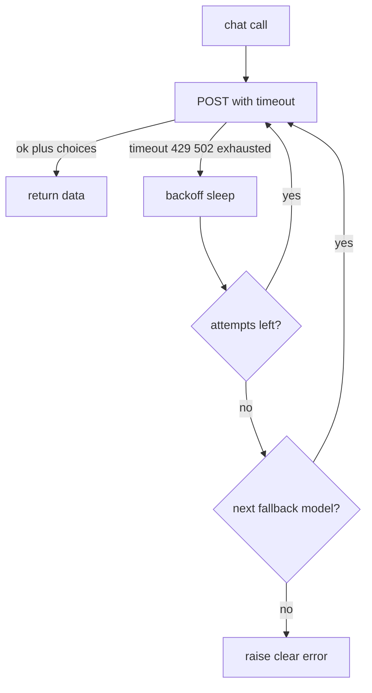

# agent-unwrapped

See the wire: raw agent loop — messages → tools → agents → evals. No framework required.

Progressive path from one API message through **tools**, **MCP**, the **agent loop**, and **evals**. Frameworks are optional (lesson 12) — same loop, they own the `while`. Python packages + [lessons/NOTES.md](lessons/NOTES.md).

## Quick start

**Python 3.10+** (3.12 recommended; `mcp` SDK needs ≥3.10).

```bash
python3.12 -m venv .venv
source .venv/bin/activate
pip install -r requirements.txt
cp .env.example .env   # add OPENROUTER_API_KEY
python lessons/00_mental_model.py
```

## Curriculum

| # | Lesson | Run |
|---|---|---|
| 00 | Mental model | `python lessons/00_mental_model.py` |
| 01 | Message | `python lessons/01_message.py` |
| 02 | Multi-message | `python lessons/02_multi_message.py` |
| 03 | Chat (+ constrained) | `python lessons/03_chat.py` |
| 04 | Tool (plain Python) | `python lessons/04_tool.py` |
| 05 | Tool calling | `python lessons/05_tool_calling.py` |
| 06 | MCP | `python lessons/06_mcp.py` |
| 07 | Structured data | `python lessons/07_structured.py` |
| 08 | Responses | `python lessons/08_responses.py` |
| 09 | Agent | `python lessons/09_agent.py` |
| 10 | Output / prompt evals | `python lessons/10_gen_evals.py` |
| 11 | Agent / behavior evals | `python lessons/11_agent_evals.py` |
| 12 | Frameworks (optional) | `python lessons/12_frameworks.py` |

```text
Foundation  00 → 01 → 02 → 03
Capability  04 → 05 → 06 · 07 → 08
Agency      09 agent loop
Measure     10 gen evals → 11 agent evals
Optional    12 frameworks (same loop; LangChain owns the while)
```

**Rule of thumb:** call the tool yourself → let the model call it → MCP standardizes access → measure answers, then trajectories → (optional) let a framework write the while.

## Layout

```
agent/                 # core loop + shared libs
  __init__.py          # exports run_agent, tools_used
  loop.py              # minimal tool loop + on_step hooks
  common.py            # OpenRouter/Anthropic chat + retries
  tools.py             # word_stats, calculator, reverse_string
mcp/                   # stdio MCP server (own package)
  server.py            # FastMCP tools + sample resources
lessons/               # NN_*.py scripts + NOTES.md
evals/                 # gen_cases.jsonl, agent_cases.jsonl
```

Lessons stay `python lessons/NN_….py` — they put the repo root on `sys.path` and import `agent.*`.

## Provider / env

| Env | Purpose | Default |
|---|---|---|
| `OPENROUTER_API_KEY` | required (unless Anthropic) | — |
| `OPENROUTER_MODEL_CHAT` | lessons 00–04, 07–08, 10 | `openai/gpt-oss-20b:free` |
| `OPENROUTER_MODEL_CHAT_FALLBACKS` | after chat retries fail | `gemma-4-31b-it:free`, `gpt-oss-20b:free` |
| `OPENROUTER_MODEL_TOOLS` | lessons **05, 09, 11, 12** (must support `tools`) | `openai/gpt-oss-20b:free` |
| `OPENROUTER_MODEL_TOOLS_FALLBACKS` | after tools retries fail | `gemma-4-31b-it:free`, `openrouter/free` |
| `LLM_PROVIDER` | `openrouter` or `anthropic` | `openrouter` |

Free Nemotron often stalls — prefer `gpt-oss` for chat/evals (see `.env.example`).  
Quota exhausted? `LLM_PROVIDER=anthropic` + `ANTHROPIC_API_KEY`.  
Tool-capable models: [openrouter.ai/models?supported_parameters=tools](https://openrouter.ai/models?supported_parameters=tools).

## Notes & reliability

- Lessons **00–11** are framework-free; **12** is optional LangChain on the same loop.
- Concepts / FAQ → [lessons/NOTES.md](lessons/NOTES.md).
- Free OpenRouter flakes (`429`/`502`/timeouts). `agent.common.chat` retries 3× with backoff, then tries `OPENROUTER_MODEL_*_FALLBACKS`. Watch for `[common.chat] retry…` / `fallback model → …`.
- Local package name `mcp/` shadows the PyPI SDK if imported after the repo is on `sys.path`. Lesson 06 imports the SDK first; always run the server as `python mcp/server.py` (not `python -m mcp.server`).

<details>
<summary>Retry flowchart</summary>



</details>

## Optional: Cursor MCP

```json
{
  "mcpServers": {
    "agent-unwrapped-tools": {
      "command": "/ABS/PATH/agent-unwrapped/.venv/bin/python",
      "args": ["/ABS/PATH/agent-unwrapped/mcp/server.py"]
    }
  }
}
```
