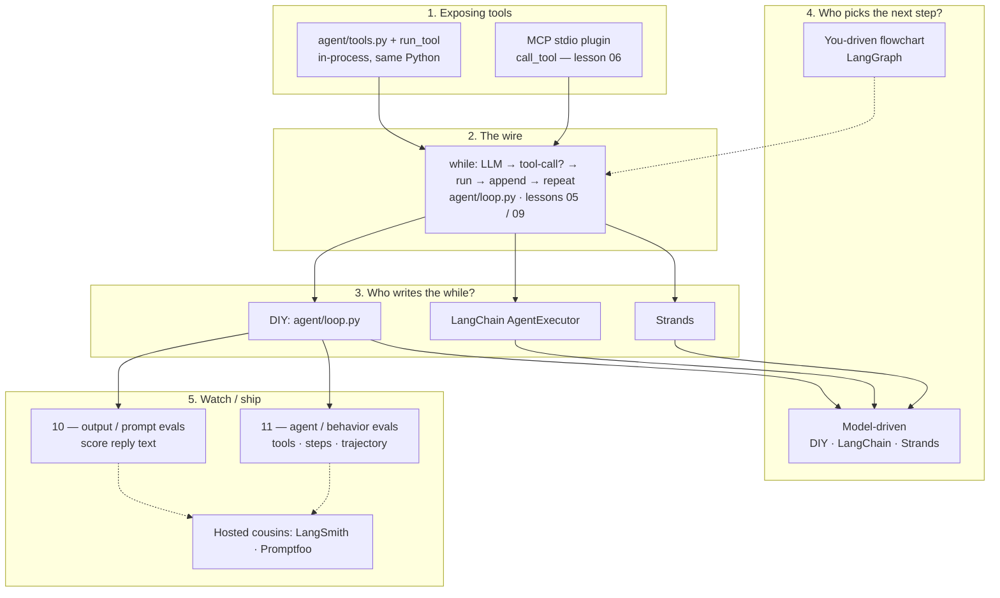

# Lesson notes

Run: `python lessons/NN_….py`. Cheat sheet for the mental model — not a book.

---

## The summary loop

```text
message  →  chat()  →  model
                          │
                   tool-call?
                    │        │
                   yes      no
                    │        └──► final text (done)
                    ▼
         run_tool  /  MCP call_tool
                    │
         append role=tool  →  loop (chat again)
```

Same cycle whether you write it by hand (05), package it (`agent/loop.py`), or let a framework own the `while`.

### Message append order

```text
[user]                         ← you write once (or each new human turn)
chat()
[assistant + tool_calls]       ← append API message as-is
[tool result]…                 ← you append after run_tool / call_tool
chat() again …
[assistant final text]         ← no tool_calls → done
```

---

## One-pager — notebook layers



| Layer | Thing | Job |
|-------|--------|-----|
| **Expose tools** | `agent/tools.py` + `run_tool`, **MCP** | in-process vs stdio plugin (`call_tool`) |
| **Wire** | `agent/loop.py`, lessons 05 / 09 | the `while`: messages → tool_calls → run → append |
| **Who writes the while** | DIY (`agent/loop.py`) / LangChain / Strands | same loop; DIY = you write it; frameworks = optional libs that own the while plumbing |
| **Who picks next step** | **Model-driven** vs LangGraph | model chooses tools each round, *or* you fix a flowchart |
| **Watch / ship** | lessons 10–11; LangSmith / Promptfoo | score output text vs agent behavior; hosted = same idea |

Two different questions people conflate:

1. **Who writes the `while`?** — DIY (`agent/loop.py`), LangChain `AgentExecutor`, or Strands. Frameworks are optional libraries that own that plumbing — same loop, they write it.
2. **Who picks the next step?** — **model-driven** (model emits `tool_calls` each round — DIY, LangChain, Strands) vs **you-driven** (LangGraph flowchart; model fills nodes).

---

## Watch / ship — output vs behavior

| | **10 — output / prompt evals** | **11 — agent / behavior evals** |
|---|---|---|
| Asks | Did the **reply text** look right? | Did the **agent act** right? |
| Runs | `chat()` once — no tools | `run_agent()` — full loop |
| Cases | `evals/gen_cases.jsonl` | `evals/agent_cases.jsonl` |
| Checks | `contains` / `not_contains` / `max_chars` | `tools_used_subset`, `max_steps`, `forbidden_tools`, optional `success_substring` |
| Like | unit tests on generation | unit tests on trajectory |

Why both: a good answer with the wrong tools (or a bloated path) is still a bad agent; a correct tool path with garbage text still fails the user. Score text *and* behavior.

**Hosted cousins** of what you build locally: **LangSmith** (traces + evals), **Promptfoo** (prompt/agent test suites). Same split — output scoring vs trajectory/behavior — just not hand-rolled jsonl.

---

## Idea → takeaway

| Idea | Takeaway |
|---|---|
| **API memory** | No server session. Whatever is in your `messages` list *is* the convo. Resend it every `chat()`. |
| **Roles** | `user` = human; `assistant` = model (text and/or `tool_calls`); `tool` = *your* function result (`tool_call_id` must match). |
| **Who runs tools?** | Never the model. It only *asks*. You run Python (`run_tool`) or MCP (`call_tool`). |
| **Batching** | One assistant message can request **many** tools. Your loop runs each locally — still **one** LLM round. |
| **`step_count`** | = number of **LLM** `chat()` calls, not number of tools. |
| **Tokens / $** | `prompt` ≈ input; `completion` ≈ output bill (often includes thinking); `reasoning_tokens` ⊆ completion when exposed. Short `content` ≠ cheap if the model reasoned hard. Use `print_usage()`. |
| **`max_tokens`** | Caps the output bucket. Reasoning models can burn it on thinking and leave `content: null` — keep evals ≥ ~200. |
| **Tools registry** | Function in `agent/tools.py` + entry in `TOOL_SPECS` (menu for model) + `DISPATCH` (name → call). `run_tool` uses `DISPATCH` — it is **not** itself a tool. |
| **MCP** | Stdio JSON-RPC **plugin process**, not a FastAPI URL. Client (`06`) spawns `mcp/server.py`. Local dir `mcp/` shares the PyPI name — import the SDK before adding repo root to `sys.path`; run the server as a script, not `python -m mcp.server`. |
| **05 vs 09** | Same loop. 05 teaches it inline; `agent.loop` packages it + `on_step` hooks. |
| **Hooks** | You pass `on_step=fn`. Agent **labels** events (`llm` / `tool` / `messages` / `final`) — not magic from the API. |

### Free OpenRouter gotchas

- Daily free-model caps (`429` / `free-models-per-day`) — retries won’t invent quota.
- Prefer `openai/gpt-oss-20b:free` for chat/tools; free Nemotron often stalls.
- `common.chat`: timeouts, 3× backoff, then `OPENROUTER_MODEL_*_FALLBACKS`.

---

## Reliability (all API lessons)

`common.chat` handles flakes:

- timeouts `(connect=10s, read=60s)`
- up to **3** attempts with backoff `~1s → 2s → 4s`
- then **fallback models** from env
- does **not** retry `401`/`403` or most `400`s

Terminal: `[common.chat] retry…` / `fallback model → …`.

---

## Per lesson

### 00 — Mental model
Shape of one request/response. Start here for `usage` / `print_usage()`.

### 01 — Message
One user string → one assistant reply. Watch `finish_reason` (`stop` vs `length`).

### 02 — Multi-message
History is a **list**. Later turns see earlier ones (fake prior assistant = handwritten, not a previous API call).

### 03 — Chat
`system` / `user` / `assistant`; `temperature`, `max_tokens`, `stop`. Baseline vs constrained + token table.

### 04 — Tool
A tool is a normal Python function. Call it yourself — no LLM.  
`list_tools()` reads the registry; defining a function ≠ registering it for the model.

### 05 — Tool calling
Model emits `tool_calls` → you `run_tool` → append `role: tool` → chat again (loop / `MAX_ROUNDS`).  
Client ↔ model only; tools run **beside** that, in your process. Banners + final convo memory.

### 06 — MCP
**Client** `06_mcp.py` starts **server** `mcp/server.py` as a subprocess (stdio pipes — **no URL**).  
`initialize` → `list_tools` / resources / prompts → `call_tool` / `read_resource`.  
Do **not** type into the server alone (`mcp dev` needs `pip install "mcp[cli]"`). No LLM in this lesson — protocol only.

### 07 — Structured data
Ask for JSON, **validate** (pydantic). Fail loud on bad shape.

### 08 — Responses
Anatomy: `content`, `finish_reason`, `usage`, `tool_calls`. Debug from the payload.

### 09 — Agent
`agent/loop.py` = reusable 05 loop (`from agent import run_agent`). `step_count` = LLM rounds.  
`on_step` events: `llm` (raw API), `tool` (args/result), `messages` (history), `final`.

### 10 — Output / prompt evals
Score **reply text** only (`evals/gen_cases.jsonl` → `chat` → `contains` / `not_contains` / `max_chars`).  
No tools, no trajectory. Like unit tests for prompts/models. Hosted cousin: Promptfoo / LangSmith output scoring.

### 11 — Agent / behavior evals
Score **behavior**: tools used, step budget (LLM rounds), optional answer substring.  
Cases: `evals/agent_cases.jsonl`. Each case = several API calls — heavy on free tier.  
Daily `429` / `free-models-per-day` fails fast (no endless retries). Hosted cousin: LangSmith trajectory / agent evals.

### 12 — Frameworks (optional)
Same task raw vs LangChain. LangChain owns the while / messages / tool_calls plumbing — learn 00–11 first.
Both halves follow `LLM_PROVIDER` (OpenRouter or Anthropic); LangChain is not OpenRouter-only.

MCP is not a framework: it's how tools are *served*. LangGraph is a flowchart (you own control flow). LangSmith / Promptfoo watch and score. See one-pager.
